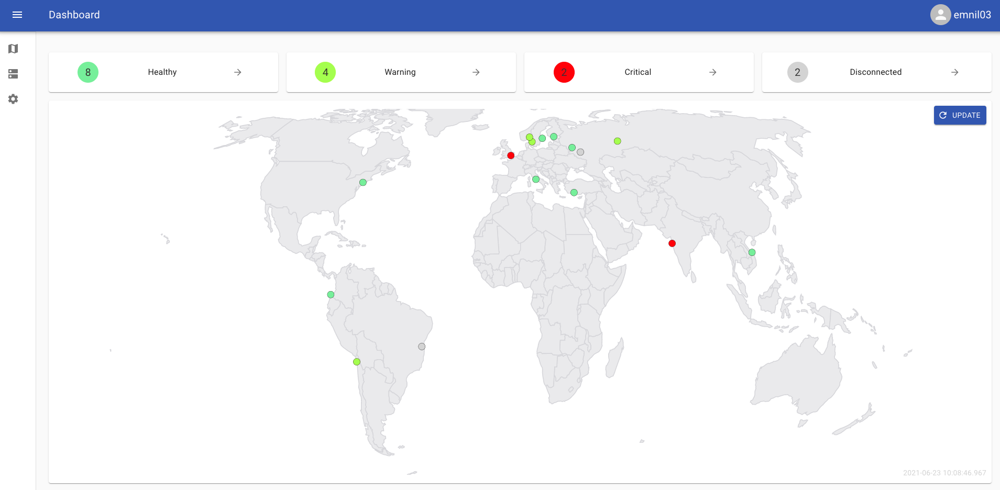
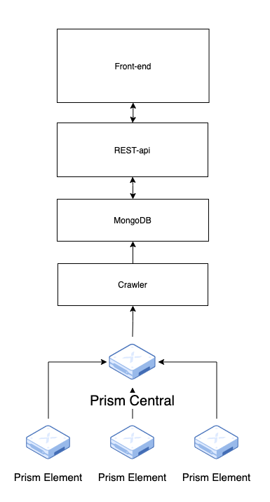
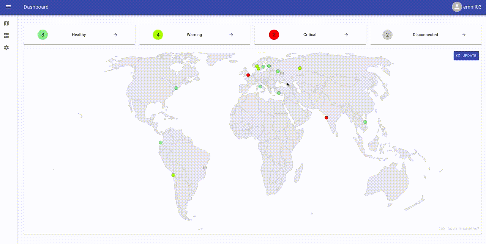
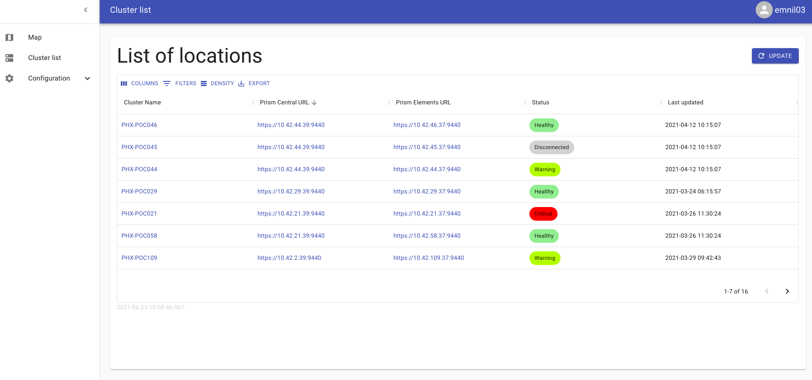
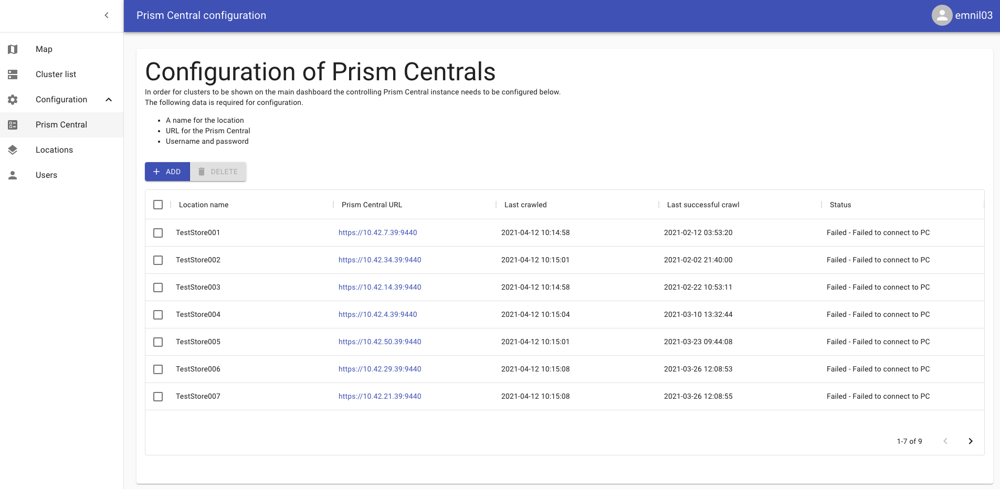
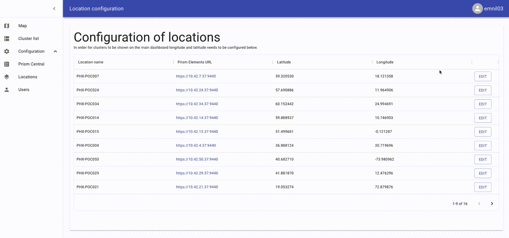
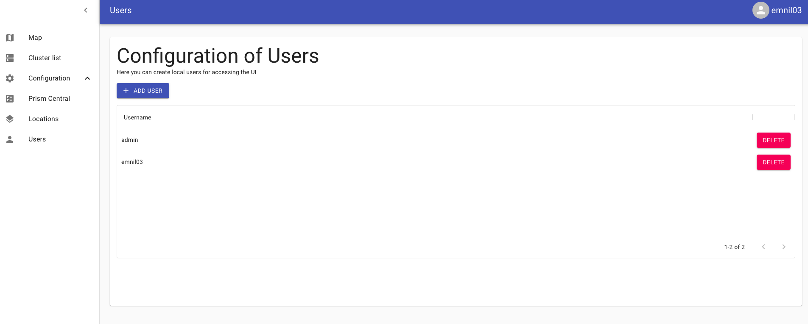

# Nutanix World map

### Application that gives you a overview of all your Prism Central deployments.


## Overview

The application consists of four main parts
 * [Front-end](frontend/)
 * [REST-api](api/)
 * [Crawler](crawler/)
 * MongoDB



## Front-end
The frontend is written in React, it communicates with the REST-api.

### Map
The map will let the user get a quick overview over the whole environtment.
If the user clicks one of the location, more details are shown. On hover, a line will be drawn to show if there are configured DR locations.


### Cluster list
The cluster list gives a quick overview of all monitored clusters and their status


### Prism Central configuration
From the UI the user can configure Prism Centrals to monitor


### Location configuration
Locations needs to be configured with an Longitude and a Latitude before they can be shown on the Map


### Users
Access to the system is limited to registerd users and/or LDAP configured access.
The system will firs check against local users and then external (LDAP) users.


## Crawler
The crawler fetches configured PC's from the database and crawls them for information

## API
The API is built using Express and Node.js. It is responsible for autenticating users, and delivering data to the frontend.

## MongoDB
MongoDB is used as the backend database. The database holds both data collected from Prism Central, as well as configuration data for the system itself.

### DB structure

#### Collections:
- alerts
    - Holds current active alerts from Prism Centrals.
    ```json
    {
        "_id" : ObjectId()
        "originating_cluster_uuid": String,
        "severity": String,
        "creation_time": String,
        "last_update_time": String,
        "resolved": Boolean,
        "acknowledged": Boolean,
        "resolution_cause_list": Array,
        "alert_msg": String,
        "alert_uuid": String
    }
    ``` 
- pc_config
    - Holds information on all Prism Centrals to be crawled by the crawler.
    ```json
    {
        "_id" : ObjectId()
        "pc_url": String,
        "pc_name": String,
        "credentials": String,
        "long": float,
        "lat": float,
        "pc_last_crawled": Int32,
        "pc_last_successfull_crawl": Int32,
        "pc_last_crawled_status": String,
        "pc_cluster_list": Array
    }
    ```
- pe_clusters
    - Holds all discovered Prism Elements Clusters
    ```json
    {
        "name": ObjectId(),
        "nodes": Array,
        "ncc": Object,
        "nos": Object,
        "network": Object,
        "analysis": Object,
        "metadata": Object,
        "uuid": String,
        "storage_capacity_bytes": String,
        "storage_usage_bytes": String,
        "memory_usage_ppm": String,
        "cpu_usage_ppm": String,
        "num_vms": String,
        "num_nodes": String,
        "lat": String,
        "long": String,
        "status": String
    }
    ```
- refreshTokens
    - Holds all active refreshtokens for JWT auth
    ```json
    {
        "_id" : ObjectId(),
        "refreshToken": String
    }
    ```
- users
    - Holds all usernames and hashed and salted passwords
    ```json
    {
        "_id" : ObjectId(),
        "username": String,
        "password": String,
        "salt": String,
        "note": String
    }
    ```

## Running

See the README of the different components for environment setup.

### Create first user
The first user needs to be created in the database manually.

Add this object to the ```users``` collection.


```JSON

    {
        username:"admin",
        hash:"064be738a216bde353d1e4f65570f6d4f29a6a0aa2eacc848467b5926d34c8d01c611e03154ed731958b18a32b3615166c0cc317da3fabc09338df07b4714bb0,
        salt:"db15145a143c6e9a821379d91ff4102d"
    }

```

This would add the user ```admin``` with password ```admin```

#### Container images are pending

# NOTICE

This software is not maintained by or supported by Nutanix.

THE SOFTWARE IS PROVIDED 'AS IS', WITHOUT WARRANTY OF ANY KIND, EXPRESS OR IMPLIED, INCLUDING BUT NOT LIMITED TO THE WARRANTIES OF MERCHANTABILITY, FITNESS FOR A PARTICULAR PURPOSE AND NONINFRINGEMENT. IN NO EVENT SHALL THE AUTHORS OR COPYRIGHT HOLDERS BE LIABLE FOR ANY CLAIM, DAMAGES OR OTHER LIABILITY, WHETHER IN AN ACTION OF CONTRACT, TORT OR OTHERWISE, ARISING FROM, OUT OF OR IN CONNECTION WITH THE SOFTWARE OR THE USE OR OTHER DEALINGS IN THE SOFTWARE.